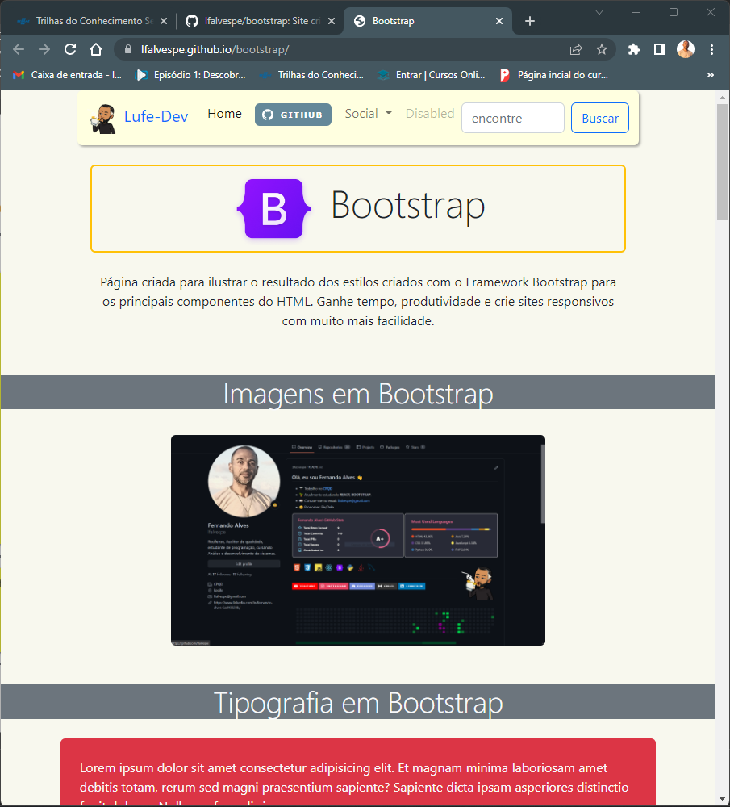
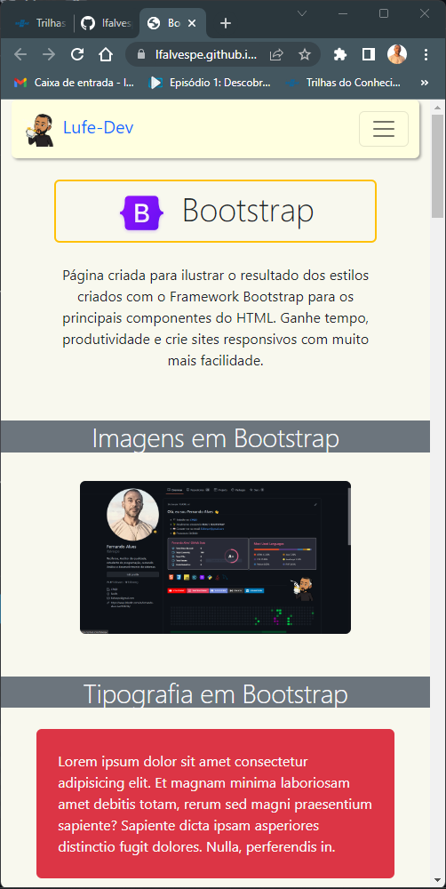

BOOTSTRAP

Site criado para mostrar a estilização dos elementos HJTML com o Framework Bootstrap

Clique para acessar: https://lfalvespe.github.io/bootstrap/

   
  
  
 
 Rápido, Prático e Responsivo.

  

